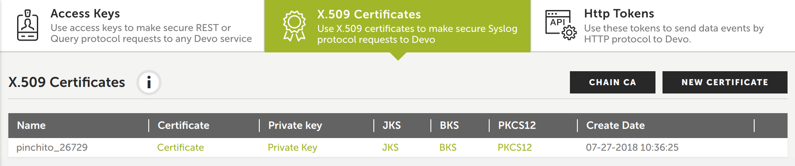

# Devo Node.js Sender

The Node.js Sender is included in the
[Devo SDK](../README.md).
It can be used to send events to Devo
and upload whole files.

## Quick Start

Install with `npm`:

    $ npm install @devo/nodejs-sdk

Send some data to Devo in your code:

``` js
const devo = require('@devo/nodejs-sdk')

const sender = devo.sender({host, port})
sender.send('my first message', () => console.log('sent'));
```

From that point you can start sending events, either as strings or as objects:

```js
sender.send('something happened')
sender.send({message: 'something happened', priority: 'high'})
```

Sender supports the [unref](https://nodejs.org/api/net.html#net_socket_unref)
method. See the official Nodejs documentation linked above for more details.
The sender creates a TCP socket underneath, and an application using the SDK
will wait until these sockets are freed before ending. This means that an
application using the SDK will not end until all sockets are properly closed.
Call `sender.end()` to close your side of the socket. Also, you can set the
`unref` option to `true`, and the sender will
['unref'](https://nodejs.org/api/net.html#net_socket_unref) the socket. In this
case, the application is responsible for being alive until all the events are
properly sent. The `sender.send(msg, cb)` method accepts a callback as the
second argument that will be called when the message has been delivered.

See detailed info on
[sender credentials](#sender-credentials),
[sending events](#sending-events)
and [command line uploads](#command-line-uploads).

## RELP Protocol

The sender supports RELP protocol emitting events for each RSP command received
and enables the resend and close commands:

```js
const sender = devo.sender({host, port, relp: true})
const txno = sender.send('a RELP message') // txno === 2
sender.resend('a RELP message', txno) // reuse txno
sender.sendClose() // sends close command
sender.on('rsp', (rsp) => {
  rsp; // { txno: 1, command: 'open', body: '200 OK' }
       // { txno: 2, command: 'syslog', body: '200 OK' }
       // { txno: 2, command: 'syslog', body: '200 OK' }
       // { txno: 3, command: 'close', body: '200 OK' }
})
```

## Sender Credentials

You need to be a customer to send events to Devo.
You can obtain your certificate and private key from
[Devo](https://www.devo.com/):
go to the "Administration/Credentials" section,
and then to
["X.509 Certificates"](https://docs.devo.com/confluence/docs/administration/administration-credentials#Administrationcredentials-X.509Certificates).



From there you will need to download Certificate (to use as `cert`)
and Private Key (as `key`) for your account.
Also you will need to download the Chain CA
to use it as `ca`.

## Sending Events

The SDK supports sending events to Devo.
First import the SDK in your code and start the sender:

``` js
const devo = require('@devo/nodejs-sdk')

const sender = devo.sender(options)
```

From there you can start sending events, either as strings or as objects:

```js
sender.send('something happened')
sender.send({message: 'something happened', priority: 'high'})
```

Devo only ingests plain text messages;
if an object is passed it will be converted to JSON before sending it.

### Sender Options

These options are passed to the `devo.sender()` constructor.
They will determine where and how to send the events.

#### `host`

Host to send the events.
Optional, default value `localhost`.
Can be looked up in Devo as
[relay
address](https://docs.devo.com/confluence/docs/system-configuration/relays),
as (host:port).

#### `port`

Port to send the events.
Mandatory.
Can be looked up in Devo as
[relay
address](https://docs.devo.com/confluence/docs/system-configuration/relays),
as (host:port).

#### `unref`

Indicates if the sender should
['unref'](https://nodejs.org/api/net.html#net_socket_unref) the TCP socket
underneath. It defaults to `false`.

#### `cert`

Certificate for sending events securely.
Optional; if not present will send events as cleartext (not recommended).
You need to pass the whole certificate, not a path.
Can be downloaded from Devo as
[sender credentials](#sender-credentials).

#### `key`

Private key for sending events securely.
Optional; must be present if `cert` is used.
You need to pass the whole key, not a path.
Can be downloaded from Devo as
[sender credentials](#sender-credentials).

#### `ca`

Certificate of the authority that created `cert` for sending events securely.
Optional; needed only if the `cert` is not signed by a recognized CA.
You need to pass the whole certificate, not a path.
Can be downloaded from Devo as
[sender credentials](#sender-credentials)
(button "Client CA").

#### `objectMode`

If the sender is going to be used as a stream and you want to
send objects, set to `true`. Objects will be converted to JSON.
Optional, default `false`.
See [send to stream](#send-to-stream) for details.

#### `rfc5424`

If truthy, will send messages using
[RFC 5424](https://tools.ietf.org/html/rfc5424)
instead of the more lax
[RFC 3164](https://tools.ietf.org/html/rfc3164).

Examples:

* Default (RFC 3164):
`<13>2019-02-15T09:10:53.975Z localhost siem.logtrust.batrasio.free: Message`
* RFC 5424:
`<13>1 2019-02-15T09:10:53.975Z localhost siem.logtrust.batrasio.free 1511 master - Message`

#### `priority`

Priority value as specified by
[RFC 5424](https://tools.ietf.org/html/rfc5424#section-6.2.1).
Optional, default value `13`.

#### `tag`

Tag to use for the events.
The tag will determine the table to store the events on Devo.
Optional, default value `my.app`.

#### `localhost`

Name of the host that generates the events.
Optional, default value `localhost.localdomain`.

#### `pid`

Process ID. Default value: `process.pid`. Only used in RFC 5424.

#### `worker`

Worker ID. Default value `master`. Only used in RFC 5424.

#### `debug`

Show messages on console before sending them. Useful for debug.

### Putting It All Together

To create the sender you will need to pass all the parameters required.
Example:

```js
const sender = devo.sender({
  host: 'app.logtrust.com',
  port: 443,
  cert: fs.readFileSync('path/to/cert'),
  key: fs.readFileSync('path/to/key'),
  ca: fs.readFileSync('path/to/ca'),
  tag: 'my.app',
})
```

### Send to Stream

The `sender` returned can be used as a writeable Node.js stream:
it can be written to, piped to and so on.
The stream also implements backpressure:
if too much data is sent at a time it will throttle the writer back.

For example, to send a file to Devo line by line:

```js
const devo = require('@devo/nodejs-sdk')
const fs = require('fs')

const sender = devo.sender(options)
const rs = fs.createReadStream('/path/to/file')
rs.pipe(sender)
```

It can also be used to send objects, which will be converted to JSON
before sending.
In this case the option `objectMode` must be set to `true`:

```js
const sender = devo.sender({
  objectMode: true,
  ...
})
sender.write({key: 'value'})
sender.end()
```

## Command Line Uploads

To send files to Devo from the command line please install the package globally:

```
npm install -g @devo/nodejs-sdk
```

Then you can use the installed command `devo-send`:

```
devo-send \
  --host eu.elb.relay.logtrust.net \
  --port 443 \
  --cert path/to/cert \
  --key path/to/key \
  --ca path/to/ca \
  --file path/to/file/to/upload
```

You must download your certificate and key from Devo;
see [sender credentials](#sender-credentials) for more details.

To see all the params please use --help.

```
devo-send --help
```

